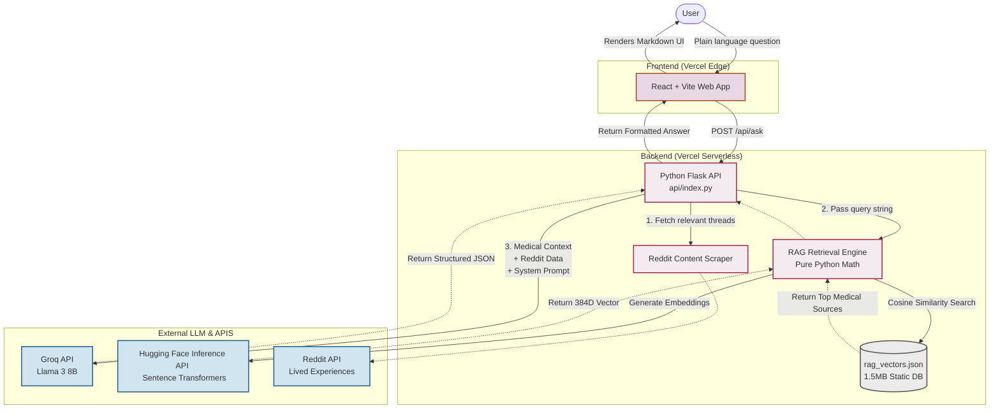

# Her Circle

Her Circle is a dedicated women's reproductive health assistant designed to provide a calm, grounded, and medical-first space for understanding your body. Unlike general web searches, Her Circle focuses on providing high-quality, cited medical information alongside synthesized lived experiences from real women.

## Core Features

-   **Medical-First Grounding (RAG)**: Uses Retrieval-Augmented Generation to provide answers based on curated medical sources and trusted organizations.
-   **Lived experience Context**: Synthesizes relevant discussions from real-world communities (Reddit) to provide balanced, empathetic context.
-   **Safety & Scope Focus**: Automatically identifies urgent symptoms and redirects out-of-scope queries to ensure a focused health experience.
-   **Premium UI/UX**: A calm, interactive interface with smooth scroll-reveal animations and a dynamic cursor-following pink glow for a polished modern feel.
-   **Multilingual Support**: Intelligent detection and response in the user's preferred language.

## Tech Stack

### Frontend
- **Framework**: React 18
- **Build Tool**: Vite
- **Styling**: Vanilla CSS (Custom Design System & Animations)
- **Deployment**: Vercel Static Hosting

### Backend
- **Framework**: Python (Flask) wrapped as a Serverless Function (`api/index.py`)
- **LLM**: Llama 3 (via Groq API)
- **Embeddings**: Hugging Face Inference API (`sentence-transformers/all-MiniLM-L6-v2`)
- **Vector Database**: Pre-computed `rag_vectors.json` (Serverless fallback, replaces ChromaDB)
- **Data Gathering**: Custom scrapers for medical sources and Reddit threads

---

## Architecture

The following flowchart illustrates the architecture and data flow of Her Circle:



---

## Getting Started

### Prerequisites
- Python 3.9+
- Node.js 16+
- A Groq API Key (get one free at [console.groq.com](https://console.groq.com))
- A Hugging Face API Key (get a free 'Read' token at [huggingface.co](https://huggingface.co/settings/tokens))

### API & Backend Setup
1. Clone the repository and navigate to the project root:
   ```bash
   cd her-circle
   ```
2. Create and activate a virtual environment:
   ```bash
   python -m venv venv
   
   # Windows:
   venv\Scripts\activate
   # macOS/Linux:
   source venv/bin/activate
   ```
3. Install dependencies:
   ```bash
   pip install -r requirements.txt
   ```
4. Create a `.env` file in the `backend/` folder:
   ```env
   GROQ_API_KEY=your_groq_api_key_here
   HF_API_KEY=hf_your_hugging_face_token_here
   HERCIRCLE_TOPIC_CACHE_TTL_SECONDS=21600
   ```
5. Run the server locally:
   ```bash
   cd backend
   python app.py
   ```
   *The Flask backend will run on `http://127.0.0.1:5000`.*

### Frontend Setup
1. Navigate to the `frontend/` directory:
   ```bash
   cd frontend
   ```
2. Install dependencies:
   ```bash
   npm install
   ```
3. Start the development server:
   ```bash
   npm run dev
   ```
4. Open the application at `http://localhost:5173`.

## Future Plans / Roadmap

We are constantly looking to expand and improve **Her Circle** to make it the most helpful companion possible. Planned features include:

- **Account Profiles & Cycle Tracking**: Allowing users to log their periods and symptoms securely, enabling the AI to provide answers that are highly personalized to their current menstrual phase.
- **Expanded Medical Scope**: Broadening our curated RAG database to cover deeper topics such as menopause, pregnancy, postpartum mental health, and fertility treatments (like IVF).
- **Multimodal Inputs**: Allowing users to upload pictures of ovulation tests or tracking charts for a more interactive analysis experience.
- **Video Integrations**: Surfacing highly relevant YouTube videos from trusted medical creators and educators for users who learn better visually.
- **Community "Verified" Sharing**: An opt-in feature allowing users to anonymously share particularly helpful AI Q&A threads and their own experiences with the broader Her Circle community.

---

## Project Structure

```text
her-circle/
├── api/
│   └── index.py              # Serverless entry point for Vercel deployment
├── backend/
│   ├── data/                 # Vector & Cache Data
│   │   ├── rag_vectors.json  # Lightweight vector index for Serverless RAG
│   │   ├── curated_sources.json
│   │   └── rag_manifest.json
│   ├── app.py                # Main Flask API and LLM orchestration
│   ├── ingest.py             # Data ingestion & ChromaDB indexing (Local only)
│   ├── export_vectors.py     # Script to convert ChromaDB to rag_vectors.json
│   ├── rag.py                # Serverless & Local Medical retrieval logic
│   ├── reddit.py             # Reddit scraper and synthesis logic
│   └── scraper.py            # Primary web scraper for medical sources
├── frontend/
│   ├── public/               # Static assets
│   ├── src/
│   │   ├── App.css           # Global design system & animations
│   │   ├── App.jsx           # Main application shell & logic
│   │   ├── index.css         # Basic resets
│   │   └── main.jsx          # React entry point
│   ├── package.json          # Frontend dependencies & build scripts
│   └── vite.config.js        # Vite configuration
├── vercel.json               # Serverless routing rules
├── requirements.txt          # Python dependencies
└── README.md                 # Project documentation
```
